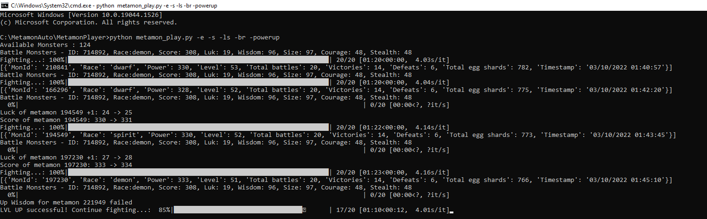

# MetamonPlayer
Simple program to play Metamon automatically.

# Donate
<b>If you can please donate little bit Raca or Eggs to</b> 

	0x3c27669094b8B7F7336376e256146DDa8E36ECe8 
	
<b>THANK YOU SO MUCH</b> 

# Getting Started
This program is converted from https://github.com/MetaMon-game-player/MetamonPlayer to add some functions:
- Automatically up exp
- Automatically up power
- Display opponent metamon's attribute in stattus file
- Create log to see battle record
- Choose lowest metamon battle to increase win rate
- Calculate power up rate success
- Calculate opponent metamon crit times in each battle 

[Radio Caca]

[Radio Caca]: https://www.radiocaca.com

## Important disclaimer
This software is intended for use by individuals 
familiar with Python programming language. It uses
sensitive signature code from MetaMask wallet which 
needs to be safe and secure at all times. Make sure 
to inspect the code for any attempts to send your 
information anywhere except https://metamon-api.radiocaca.com/usm-api 
(official metamon game api). We are not responsible 
for any loss incurred if you used modified version 
of this code from other sources!

## Prerequisites

To start using this program Python needs to be 
installed and some packages. The easiest way to 
obtain Python is to install [miniconda], use 
latest release for your platform Linux/Mac/Windows

[miniconda]: https://docs.conda.io/en/latest/miniconda.html

After installation open command line with 
virtual environment activated and run following
command

    pip install tqdm requests pandas argparse

to install all necessary packages

## Prepare wallet(s) information

First open [game] with your browser and make sure 
your wallet is active in MetaMask plugin. Enter
dev mode in browser (Chrome press Ctrl + Shift + I,
or go to menu -> More Tools -> Developer Tools)

select "Network" and "Fetc/XHR" in developer tools menu.

[game]: https://metamon.radiocaca.com

! <b>Imoprtant: make sure to do it before signing 
in with MetaMask</b> !

After login entry with "login" name should appear 
in the list of requests of developers tools.

There
after clicking on it and selecting "payload" in new 
menu all 3 essential values wil appear (address, sign, 
msg) copy those values and save in file (for example
default is "wallets.tsv" in same dir where you run it).

File should have 4 columns tab separated (tsv):

    name    address sign    msg
    Wallet1 0x123.. 0x23... LogIn-...

Name is custom, choose what you want. If you save 
stats to file it will be used for name of that file.
If you have multiple wallets you can add several rows
to this tsv file.

# Preparation is complete! 
## Ready to roll?

To get familiar run metamon_player.py to get help
    
    python metamon_play.py --help

Message:
    
    usage: metamon_play.py [-h] [-i INPUT_TSV] [-nl] [-nb] [-e] [-s] [-ofm] [-ls] [-expup] [-powerup] [-br]

    optional arguments:
    -h, --help            show this help message and exit
    -i INPUT_TSV, --input-tsv INPUT_TSV
    Path to tsv file with wallets' access records (name, address, sign, login message) name is used for filename with table of results.
    Results for each wallet are saved in separate files
    -nl, --no-lvlup       			Disable automatic lvl up (if not enough potions/diamonds it will be disabled anyway) by default lvl up will be attempted after each battle
    -nb, --skip-battles   			No battles, use when need to only mint eggs from shards
    -e, --mint-eggs       			Automatically mint eggs after all battles done for a day
    -s, --save-results    			To enable saving results on disk use this option. Two files <name>_summary.tsv and <name>_stats.tsv will be saved in current dir.
	-ofm, --other-fighting-mode, 	To select metamon have lowest Wisdom, Size, Luck, Courage, Stealth to play for more win
	-ls, --lowest-score, 			To select metamon have lowest score by hardcode metamon id
	-expup, --auto-exp-up, 			Automatically up exp for metamon before battle
	-powerup, --auto-power-up, 		Automatically up power for metamon before battle. Priority of attribute will be upgraded Courage < 50, Wisdom < 101, Size < 101, Stealth < 50 and Luck
	-br,--battle-record, 			Watching record of each battle, Creating log after finish
	
For example:

Power up only mode

	python metamon_play.py -nb -powerup
	

Exp up only mode

	python metamon_play.py -nb -expup
	

	
Play with metamon lowest score in rank

    python metamon_play.py -e -s	
	
Play with sorted metamon lowest attribute in rank (Score, luk, courage, stealth, wisdom, size)

	python metamon_play.py -e -s -ofm
	
Play only one lowest score metamon (metamon is hardcode id)

	python metamon_play.py -e -s -ls
	
Play, Log battle, auto power up (Recommend using if don't need up exp for metamon)

	python metamon_play.py -e -s -ls -br -powerup

	

	
Play only one lowest score metamon, auto power up, auto exp up

	python metamon_play.py -e -s -ls -powerup -expup  
	
Summary with up power rate

	
Will try to read file wallets.tsv in current dir,
auto fight, mint eggs, and save stats to corresponding 
files. Now you ready to have fun and explore other options.

<b> Note: </b> Since fee for all leagues is the same bot will 
try to fight in highest league for corresponding metamon and 
it is not configurable at this 
time.

Also if there will be interest we can release version which
uses access token instead of signature (tokens expire and it
is more secure to use, however it will require manual step of
obtaining one every day for battles)

Hope you will have fun playing and this script will make it 
a little bit less tedious. Enjoy!